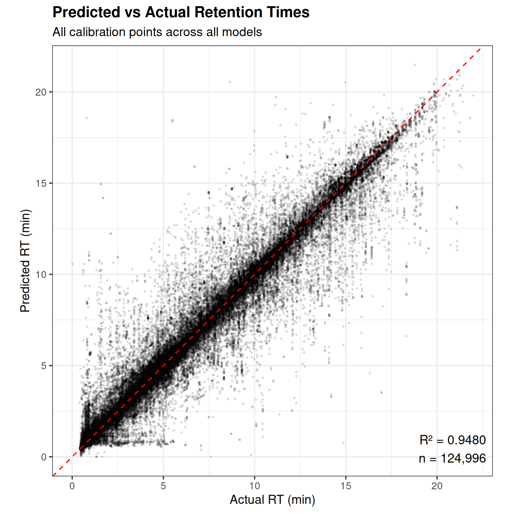
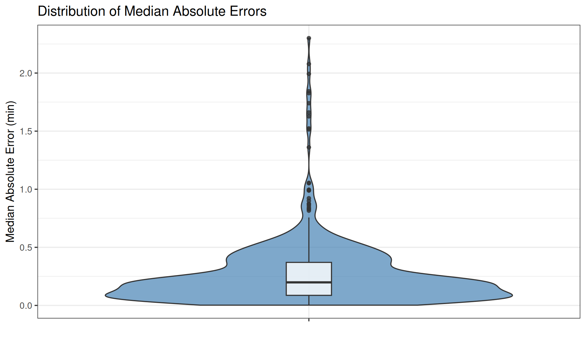
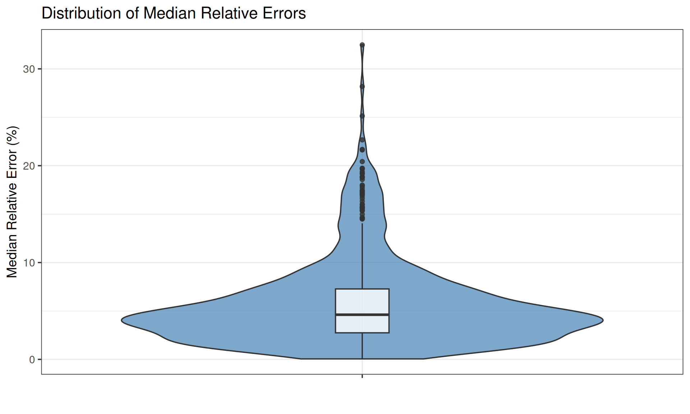
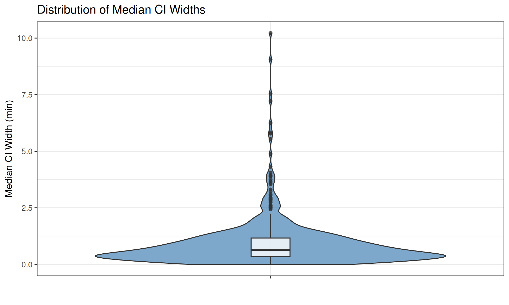
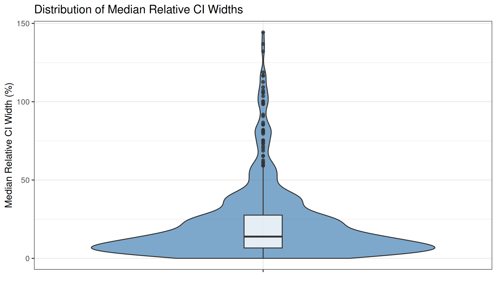
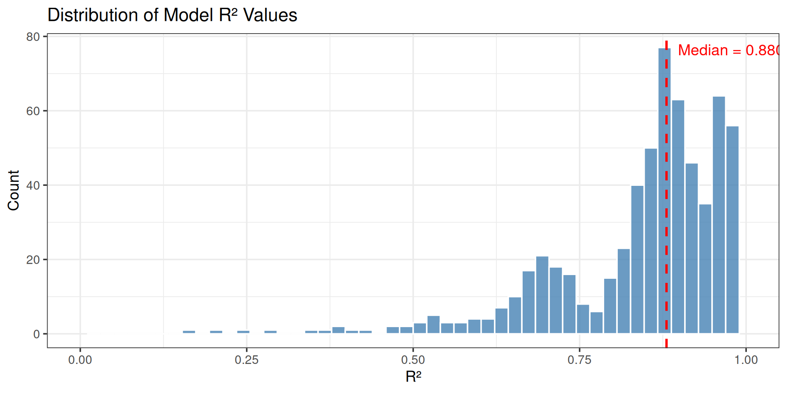
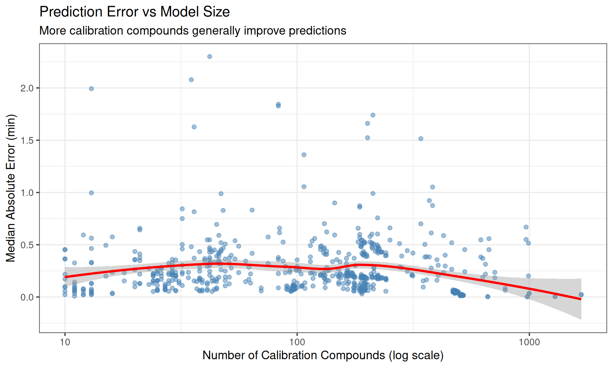

# Model Statistics

## Summary

| Statistic            |   Value |
|:---------------------|--------:|
| Total Models         |     642 |
| Total Systems        |      30 |
| Calibration Points   | 124,996 |
| Mean Compounds/Model |   194.7 |
| Median R²            |  0.8805 |
| Min R²               |  0.1633 |

## Predicted vs Actual RT (Figure 3B)

This plot shows the relationship between predicted and actual retention
times across all calibration points, similar to Figure 3B in the
original PredRet paper.

## Error Distributions (Figure 3C,D)

### Absolute Prediction Errors

### Relative Prediction Errors

## CI Width Distributions (Figure 3E,F)

### Absolute CI Widths

### Relative CI Widths

## Statistics by Method Type

## R² Distribution

    Warning: Removed 2 rows containing missing values or values outside the scale range
    (`geom_bar()`).

## Model Quality vs Number of Compounds

    `geom_smooth()` using formula = 'y ~ x'

## Full Model Table

| From | To   |    N |     R² | Error (min) | Error (%) | CI (min) | CI (%) |
|:-----|:-----|-----:|-------:|------------:|----------:|---------:|-------:|
| 0382 | 0383 | 1673 | 0.9808 |       0.023 |      0.30 |    0.080 |   1.06 |
| 0383 | 0382 | 1673 | 0.9809 |       0.022 |      0.29 |    0.083 |   1.10 |
| 0382 | 0436 | 1290 | 0.9982 |       0.004 |      0.06 |    0.013 |   0.18 |
| 0436 | 0382 | 1290 | 0.9982 |       0.004 |      0.05 |    0.016 |   0.20 |
| 0383 | 0436 |  998 | 0.9819 |       0.036 |      0.52 |    0.116 |   1.79 |
| 0436 | 0383 |  998 | 0.9819 |       0.034 |      0.56 |    0.105 |   1.61 |
| 0186 | 0391 |  991 | 0.8397 |       0.201 |      7.18 |    0.160 |   5.13 |
| 0391 | 0186 |  991 | 0.7970 |       0.515 |      4.05 |    0.359 |   2.94 |
| 0225 | 0228 |  980 | 1.0000 |       0.002 |      0.06 |    0.001 |   0.02 |
| 0228 | 0225 |  980 | 1.0000 |       0.002 |      0.06 |    0.001 |   0.02 |
| 0262 | 0263 |  968 | 0.6978 |       0.669 |      5.85 |    0.520 |   3.90 |
| 0263 | 0262 |  968 | 0.6972 |       0.550 |      4.81 |    0.676 |   4.75 |
| 0063 | 0391 |  787 | 0.9542 |       0.065 |      2.46 |    0.062 |   2.27 |
| 0391 | 0063 |  787 | 0.9509 |       0.084 |      1.52 |    0.079 |   1.52 |
| 0262 | 0382 |  710 | 0.8740 |       0.184 |      2.46 |    0.234 |   3.27 |
| 0382 | 0262 |  710 | 0.8666 |       0.236 |      1.87 |    0.318 |   2.54 |
| 0263 | 0382 |  670 | 0.6638 |       0.452 |      5.81 |    0.550 |   7.37 |
| 0382 | 0263 |  670 | 0.6634 |       0.558 |      4.85 |    0.767 |   5.62 |
| 0219 | 0429 |  662 | 0.9997 |       0.003 |      0.07 |    0.011 |   0.28 |
| 0429 | 0219 |  662 | 0.9997 |       0.003 |      0.07 |    0.014 |   0.30 |
| 0262 | 0383 |  647 | 0.8584 |       0.219 |      3.33 |    0.309 |   4.67 |
| 0383 | 0262 |  647 | 0.8586 |       0.314 |      2.57 |    0.506 |   4.07 |
| 0382 | 0391 |  630 | 0.8481 |       0.189 |      7.39 |    0.217 |   8.49 |
| 0391 | 0382 |  630 | 0.8535 |       0.370 |      5.74 |    0.411 |   5.97 |
| 0263 | 0383 |  618 | 0.7221 |       0.383 |      5.16 |    0.470 |   6.07 |
| 0383 | 0263 |  618 | 0.7142 |       0.546 |      4.82 |    0.829 |   6.23 |
| 0383 | 0391 |  527 | 0.8143 |       0.242 |      9.45 |    0.289 |  10.84 |
| 0391 | 0383 |  527 | 0.8181 |       0.454 |      6.97 |    0.523 |   7.90 |
| 0244 | 0246 |  520 | 0.9982 |       0.016 |      0.60 |    0.037 |   0.93 |
| 0246 | 0244 |  520 | 0.9982 |       0.017 |      0.61 |    0.038 |   0.96 |
| 0236 | 0238 |  516 | 0.9971 |       0.020 |      0.60 |    0.041 |   1.10 |
| 0238 | 0236 |  516 | 0.9953 |       0.014 |      0.44 |    0.030 |   0.93 |
| 0246 | 0248 |  516 | 0.9983 |       0.014 |      0.52 |    0.030 |   0.88 |
| 0248 | 0246 |  516 | 0.9982 |       0.013 |      0.54 |    0.033 |   1.12 |
| 0238 | 0240 |  513 | 0.9997 |       0.014 |      0.47 |    0.021 |   0.65 |
| 0240 | 0238 |  513 | 0.9997 |       0.014 |      0.48 |    0.023 |   0.63 |
| 0252 | 0256 |  513 | 0.9991 |       0.024 |      0.71 |    0.039 |   1.07 |
| 0256 | 0252 |  513 | 0.9990 |       0.024 |      0.76 |    0.043 |   1.09 |
| 0244 | 0248 |  507 | 0.9933 |       0.025 |      1.00 |    0.044 |   1.39 |
| 0248 | 0244 |  507 | 0.9920 |       0.025 |      0.99 |    0.067 |   2.13 |
| 0252 | 0254 |  507 | 0.9995 |       0.018 |      0.59 |    0.027 |   0.66 |
| 0254 | 0252 |  507 | 0.9995 |       0.018 |      0.54 |    0.029 |   0.70 |
| 0236 | 0240 |  504 | 0.9989 |       0.025 |      0.93 |    0.050 |   1.59 |
| 0240 | 0236 |  504 | 0.9988 |       0.026 |      0.84 |    0.049 |   1.29 |
| 0254 | 0256 |  504 | 0.9997 |       0.012 |      0.34 |    0.018 |   0.49 |
| 0256 | 0254 |  504 | 0.9997 |       0.012 |      0.36 |    0.020 |   0.50 |
| 0238 | 0246 |  494 | 0.9758 |       0.045 |      1.55 |    0.109 |   3.44 |
| 0246 | 0238 |  494 | 0.9755 |       0.051 |      1.41 |    0.102 |   2.52 |
| 0238 | 0252 |  493 | 0.9709 |       0.039 |      1.07 |    0.077 |   2.07 |
| 0252 | 0238 |  493 | 0.9715 |       0.040 |      1.15 |    0.100 |   2.24 |
| 0238 | 0256 |  488 | 0.9666 |       0.047 |      1.34 |    0.082 |   1.90 |
| 0256 | 0238 |  488 | 0.9663 |       0.050 |      1.32 |    0.085 |   2.23 |
| 0246 | 0252 |  487 | 0.9785 |       0.054 |      1.63 |    0.139 |   3.33 |
| 0252 | 0246 |  487 | 0.9789 |       0.051 |      1.81 |    0.118 |   3.50 |
| 0236 | 0252 |  486 | 0.9679 |       0.043 |      1.24 |    0.081 |   2.31 |
| 0246 | 0256 |  486 | 0.9782 |       0.057 |      1.97 |    0.123 |   3.33 |
| 0252 | 0236 |  486 | 0.9687 |       0.042 |      1.16 |    0.076 |   1.85 |
| 0256 | 0246 |  486 | 0.9783 |       0.055 |      1.69 |    0.122 |   3.76 |
| 0238 | 0254 |  485 | 0.9727 |       0.044 |      1.34 |    0.073 |   1.85 |
| 0240 | 0256 |  485 | 0.9755 |       0.039 |      1.03 |    0.075 |   1.74 |
| 0246 | 0254 |  485 | 0.9796 |       0.051 |      1.77 |    0.125 |   3.11 |
| 0254 | 0238 |  485 | 0.9724 |       0.047 |      1.23 |    0.084 |   2.16 |
| 0254 | 0246 |  485 | 0.9795 |       0.049 |      1.61 |    0.114 |   3.44 |
| 0256 | 0240 |  485 | 0.9762 |       0.041 |      1.16 |    0.071 |   1.60 |
| 0240 | 0252 |  484 | 0.9808 |       0.039 |      1.16 |    0.076 |   1.95 |
| 0252 | 0240 |  484 | 0.9814 |       0.042 |      1.22 |    0.082 |   1.72 |
| 0244 | 0252 |  483 | 0.9682 |       0.049 |      1.71 |    0.120 |   2.93 |
| 0252 | 0244 |  483 | 0.9674 |       0.053 |      1.65 |    0.137 |   3.68 |
| 0236 | 0246 |  482 | 0.9765 |       0.048 |      1.66 |    0.098 |   3.51 |
| 0240 | 0246 |  482 | 0.9775 |       0.041 |      1.33 |    0.092 |   2.81 |
| 0246 | 0236 |  482 | 0.9753 |       0.056 |      1.69 |    0.103 |   2.58 |
| 0246 | 0240 |  482 | 0.9776 |       0.047 |      1.32 |    0.090 |   2.17 |
| 0236 | 0254 |  481 | 0.9738 |       0.053 |      1.78 |    0.089 |   2.45 |
| 0236 | 0256 |  481 | 0.9709 |       0.056 |      1.79 |    0.094 |   2.47 |
| 0254 | 0236 |  481 | 0.9736 |       0.055 |      1.44 |    0.084 |   1.99 |
| 0256 | 0236 |  481 | 0.9714 |       0.061 |      1.59 |    0.087 |   2.12 |
| 0238 | 0244 |  480 | 0.9682 |       0.049 |      1.42 |    0.098 |   3.38 |
| 0244 | 0238 |  480 | 0.9686 |       0.050 |      1.49 |    0.113 |   2.67 |
| 0244 | 0254 |  479 | 0.9680 |       0.058 |      1.76 |    0.119 |   3.11 |
| 0254 | 0244 |  479 | 0.9659 |       0.059 |      1.79 |    0.137 |   3.75 |
| 0244 | 0256 |  478 | 0.9682 |       0.060 |      2.03 |    0.125 |   3.25 |
| 0248 | 0256 |  478 | 0.9735 |       0.057 |      1.72 |    0.133 |   3.14 |
| 0256 | 0244 |  478 | 0.9656 |       0.064 |      1.98 |    0.140 |   3.97 |
| 0256 | 0248 |  478 | 0.9730 |       0.055 |      1.81 |    0.114 |   3.37 |
| 0240 | 0254 |  477 | 0.9605 |       0.035 |      1.09 |    0.069 |   1.71 |
| 0254 | 0240 |  477 | 0.9611 |       0.038 |      0.97 |    0.072 |   1.60 |
| 0238 | 0248 |  476 | 0.9643 |       0.051 |      1.72 |    0.092 |   3.34 |
| 0248 | 0238 |  476 | 0.9626 |       0.062 |      1.49 |    0.116 |   3.05 |
| 0248 | 0252 |  473 | 0.9748 |       0.059 |      1.74 |    0.145 |   3.37 |
| 0252 | 0248 |  473 | 0.9758 |       0.063 |      2.17 |    0.132 |   3.56 |
| 0248 | 0254 |  472 | 0.9699 |       0.053 |      1.52 |    0.136 |   3.25 |
| 0254 | 0248 |  472 | 0.9700 |       0.055 |      1.72 |    0.118 |   3.26 |
| 0236 | 0244 |  471 | 0.9618 |       0.048 |      1.46 |    0.125 |   3.80 |
| 0240 | 0244 |  471 | 0.9673 |       0.047 |      1.41 |    0.101 |   3.26 |
| 0244 | 0236 |  471 | 0.9599 |       0.049 |      1.33 |    0.104 |   2.43 |
| 0244 | 0240 |  471 | 0.9684 |       0.048 |      1.42 |    0.101 |   2.44 |
| 0236 | 0248 |  469 | 0.9649 |       0.059 |      1.90 |    0.111 |   3.70 |
| 0240 | 0248 |  469 | 0.9661 |       0.047 |      1.30 |    0.096 |   3.03 |
| 0248 | 0236 |  469 | 0.9633 |       0.069 |      1.91 |    0.114 |   2.84 |
| 0248 | 0240 |  469 | 0.9660 |       0.049 |      1.32 |    0.092 |   2.15 |

Top 100 models by number of calibration compounds
