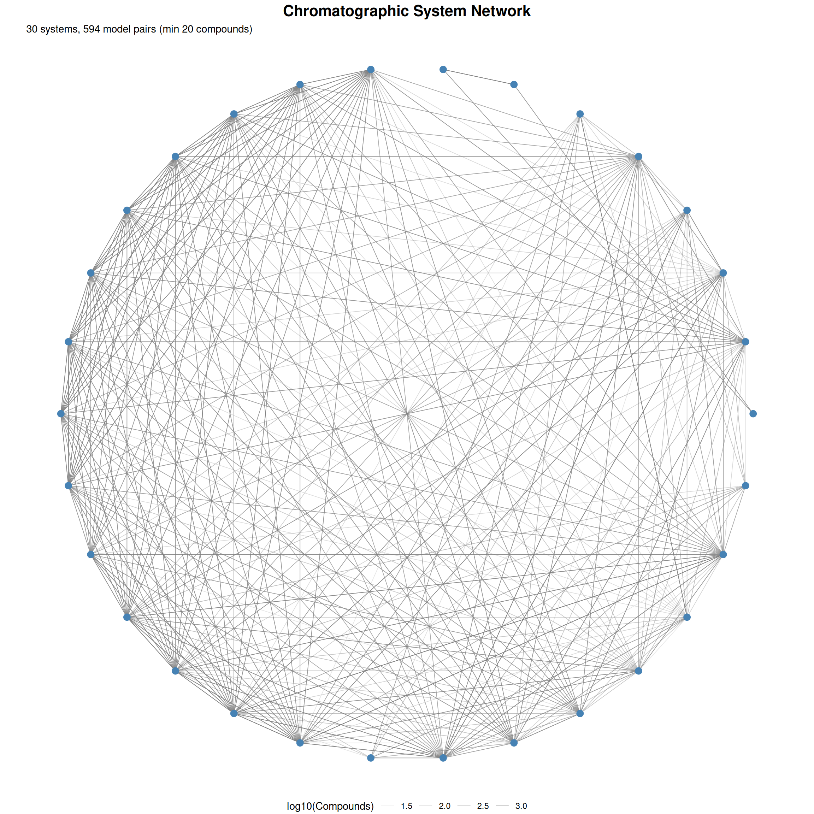
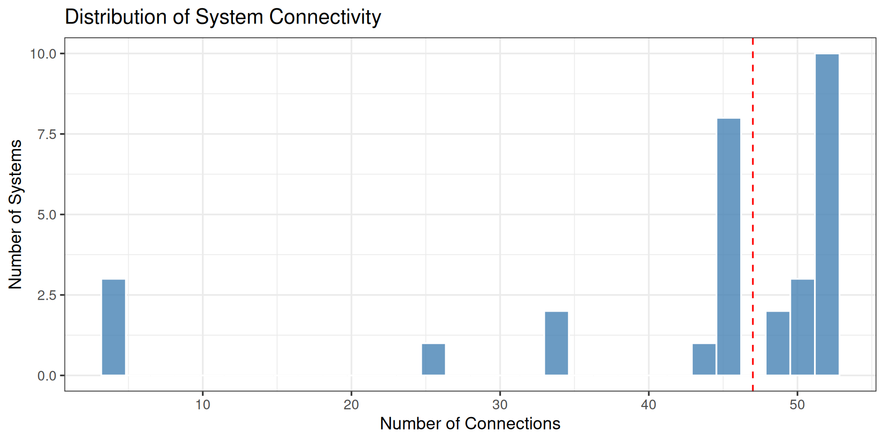
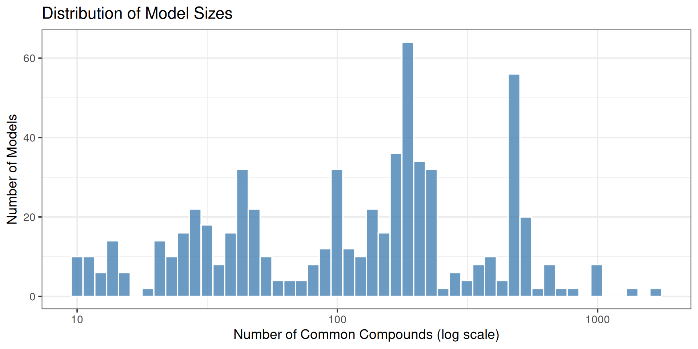

# System Network

## Network Overview

The network visualization shows how chromatographic systems are
connected through pairwise models. Each node represents a system, and
edges represent available models between systems.

| Metric                         |  Value |
|:-------------------------------|-------:|
| Total Systems (Nodes)          |     30 |
| Total Models (Edges)           |    642 |
| Average Connections per System |   42.8 |
| Network Density                | 73.79% |

## Network Visualization (Figure 2)

## Connectivity Statistics

### Systems with Most Connections

| System | Outgoing | Incoming | Total |
|:-------|---------:|---------:|------:|
| 0048   |       26 |       26 |    52 |
| 0063   |       26 |       26 |    52 |
| 0210   |       26 |       26 |    52 |
| 0262   |       26 |       26 |    52 |
| 0263   |       26 |       26 |    52 |
| 0382   |       26 |       26 |    52 |
| 0383   |       26 |       26 |    52 |
| 0391   |       26 |       26 |    52 |
| 0392   |       26 |       26 |    52 |
| 0436   |       26 |       26 |    52 |
| 0403   |       25 |       25 |    50 |
| 0415   |       25 |       25 |    50 |
| 0429   |       25 |       25 |    50 |
| 0219   |       24 |       24 |    48 |
| 0240   |       24 |       24 |    48 |
| 0236   |       23 |       23 |    46 |
| 0238   |       23 |       23 |    46 |
| 0244   |       23 |       23 |    46 |
| 0246   |       23 |       23 |    46 |
| 0248   |       23 |       23 |    46 |

Top 20 most connected systems

### Connection Distribution

## Models by Compound Count

## Heatmap of System Pairs

    Heatmap not shown: too many models for visualization
