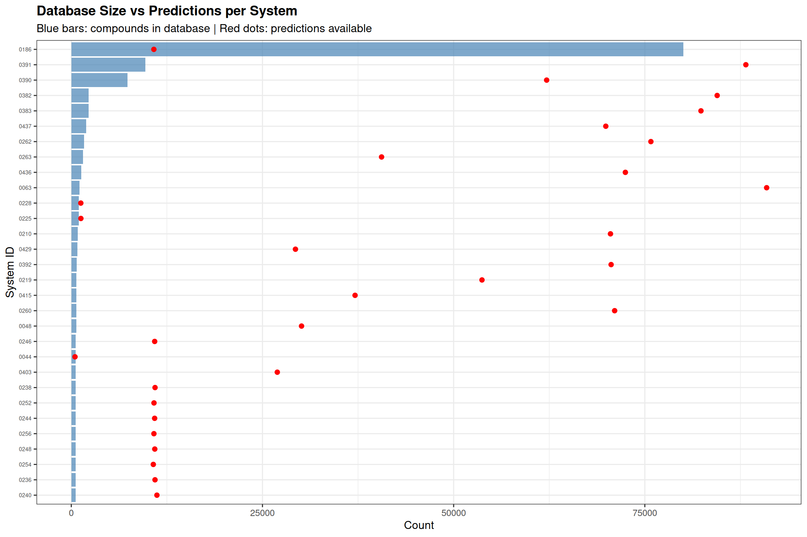
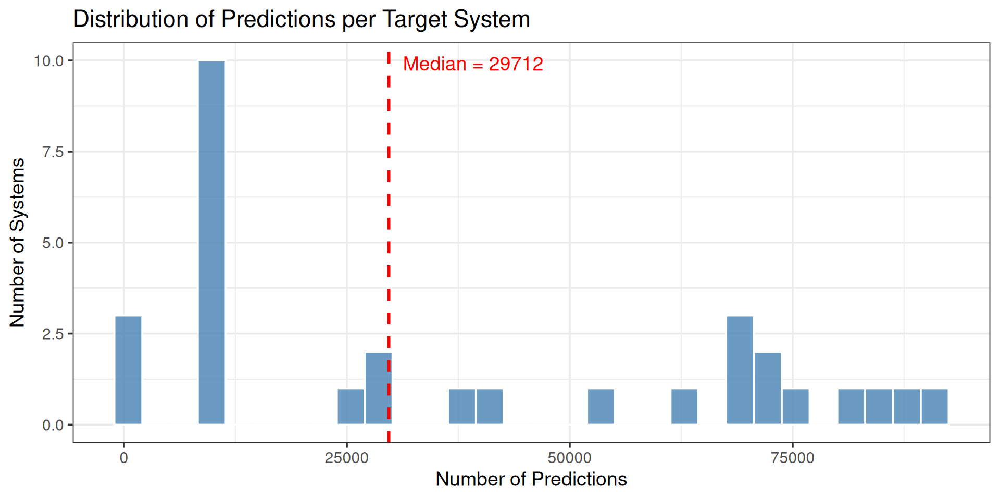
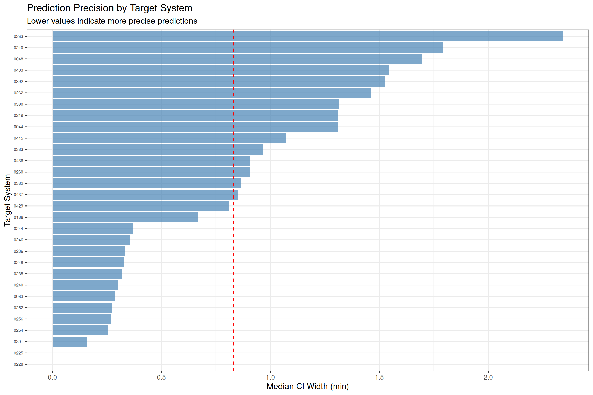
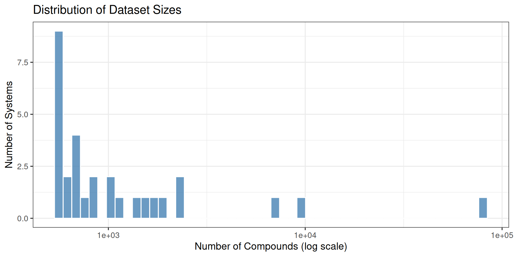

# Prediction Statistics

## Prediction Summary

| Metric                   |     Value |
|:-------------------------|----------:|
| Total Predictions        | 1,168,118 |
| Target Systems           |        30 |
| Unique Compounds         |    93,705 |
| Mean CI Width            | 0.997 min |
| Median CI Width          | 0.930 min |
| 95th Percentile CI Width | 1.946 min |

## Database Coverage (Figure 3A)

This plot shows the number of compounds in the database vs the number of
predictions available for each system.

## Predictions per System

## CI Width Distribution by System

## Database Statistics by Method Type

| Method | Systems | Total Compounds | Mean Compounds | Median RT Range (min) |
|:-------|--------:|----------------:|---------------:|----------------------:|
| HILIC  |       3 |            2593 |          864.3 |                  9.39 |
| RP     |      27 |          119965 |         4443.1 |                  9.34 |

Database coverage by chromatographic method

## Per-System Statistics

| System | Predictions | Unique Compounds | Mean CI | Median CI | Q95 CI | Mean N Cal |
|:-------|------------:|-----------------:|--------:|----------:|-------:|-----------:|
| 0063   |       90931 |            90931 |   0.377 |     0.287 |  0.969 |      320.8 |
| 0391   |       88212 |            88212 |   0.201 |     0.160 |  0.359 |      911.3 |
| 0382   |       84460 |            84460 |   0.925 |     0.867 |  1.553 |      248.7 |
| 0383   |       82343 |            82343 |   1.069 |     0.965 |  1.763 |      217.0 |
| 0262   |       75794 |            75794 |   1.351 |     1.462 |  1.985 |      129.1 |
| 0436   |       72457 |            72457 |   1.017 |     0.908 |  1.771 |      191.4 |
| 0260   |       71053 |            71053 |   0.988 |     0.907 |  1.643 |       57.6 |
| 0392   |       70593 |            70593 |   1.401 |     1.523 |  1.754 |       38.6 |
| 0210   |       70509 |            70509 |   1.619 |     1.793 |  1.983 |       71.4 |
| 0437   |       69896 |            69896 |   0.908 |     0.850 |  1.654 |       55.1 |
| 0390   |       62162 |            62162 |   1.236 |     1.315 |  1.821 |       62.6 |
| 0219   |       53706 |            53706 |   1.169 |     1.310 |  1.773 |       67.5 |
| 0263   |       40575 |            40575 |   2.157 |     2.344 |  2.684 |      158.5 |
| 0415   |       37109 |            37109 |   1.189 |     1.072 |  1.883 |       74.5 |
| 0048   |       30110 |            30110 |   1.323 |     1.696 |  1.844 |       35.9 |
| 0429   |       29314 |            29314 |   0.828 |     0.812 |  1.535 |       96.2 |
| 0403   |       26940 |            26940 |   1.495 |     1.544 |  1.851 |       34.6 |
| 0240   |       11198 |            11198 |   0.370 |     0.302 |  0.926 |      143.3 |
| 0238   |       10953 |            10953 |   0.353 |     0.318 |  0.735 |      146.3 |
| 0236   |       10949 |            10949 |   0.374 |     0.335 |  0.802 |      146.7 |
| 0248   |       10917 |            10917 |   0.376 |     0.327 |  0.939 |      145.5 |
| 0246   |       10904 |            10904 |   0.390 |     0.355 |  0.952 |      147.4 |
| 0244   |       10899 |            10899 |   0.409 |     0.370 |  0.954 |      146.2 |
| 0252   |       10815 |            10815 |   0.340 |     0.273 |  0.929 |      146.3 |
| 0256   |       10805 |            10805 |   0.321 |     0.267 |  0.799 |      147.3 |
| 0186   |       10797 |            10797 |   1.000 |     0.667 |  2.618 |      621.3 |
| 0254   |       10727 |            10727 |   0.303 |     0.255 |  0.742 |      145.5 |
| 0225   |        1257 |             1257 |   0.255 |     0.001 |  1.472 |      810.7 |
| 0228   |        1246 |             1246 |   0.246 |     0.001 |  1.500 |      816.2 |
| 0044   |         487 |              487 |   1.344 |     1.310 |  1.915 |      186.0 |

Top 50 systems by number of predictions

## Database Size Distribution

